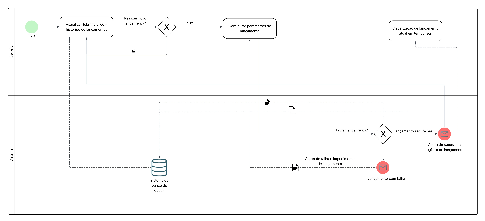

# Interface PI1 

Este repositório contém um projeto simples em Django chamado **Interface PI1**, feito para disciplina de Projeto Integrador 1, para demonstrar dashboards e receber dados de lançamento de foguete de água

## Sumário

* [Pré-requisitos](#pré-requisitos)
* [Instalação](#instalação)
* [Configuração](#configuração)
* [Execução](#execução)
* [Estrutura de Diretórios](#estrutura-de-diretórios)
* [Licença](#licença)

## Pré-requisitos

* Python 3.8 ou superior
* Pip (gerenciador de pacotes do Python)
* Git (opcional, para clonar o repositório)

> **Nota:** Recomenda-se o uso de um ambiente virtual (virtualenv ou venv).

## Instalação

1. Clone este repositório (ou faça download dos arquivos):

   ```bash
   git clone https://seu-repositorio.git
   cd seu-repositorio
   ```
2. Crie e ative o ambiente virtual:

   ```bash
   python -m venv venv
   # No Windows Powershell
   .\\venv\\Scripts\\Activate.ps1
   # No Windows CMD
   .\\venv\\Scripts\\activate.bat
   # No Linux/MacOS
   source venv/bin/activate
   ```
3. Instale as dependências:

   ```bash
   pip install -r requirements.txt
   ```

## Execução

Para executar o servidor de desenvolvimento Django:

```bash
python manage.py runserver
```

O servidor estará disponível em `http://127.0.0.1:8000/`.

Para parar o servidor, pressione `Ctrl+C`.

## Modelagem BPMN

Abaixo está a modelagem BPMN que representa o fluxo principal do sistema, desde a recepção dos dados até a exibição nos dashboards.



O diagrama completo está disponível no diretório `docs/` do projeto.


## Licença

Este projeto está licenciado sob os termos do arquivo `LICENSE`.
