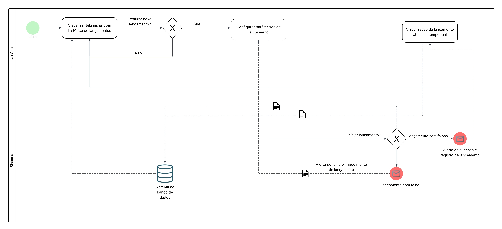
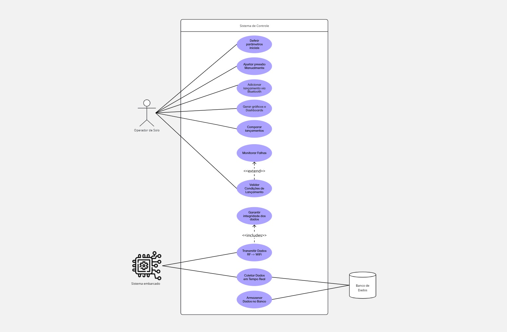
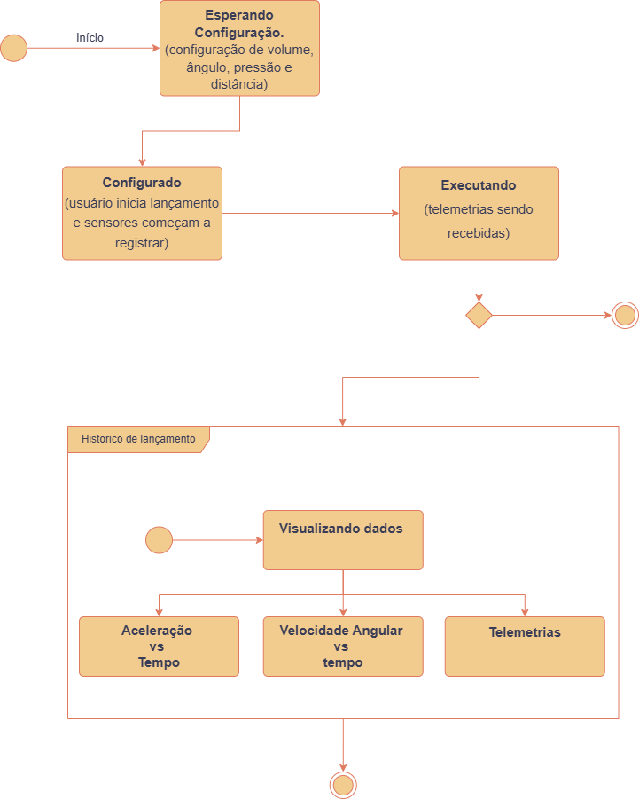
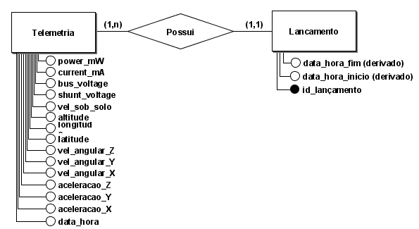

# Interface PI1 

Este repositório contém um projeto simples em Django chamado **Interface PI1**, feito para disciplina de Projeto Integrador 1, para demonstrar dashboards e receber dados de lançamento de foguete de água

## Sumário

* [Pré-requisitos](#pré-requisitos)
* [Instalação](#instalação)
* [Configuração](#configuração)
* [Execução](#execução)
* [Estrutura de Diretórios](#estrutura-de-diretórios)
* [Licença](#licença)

## Pré-requisitos

* Python 3.8 ou superior
* Pip (gerenciador de pacotes do Python)
* Git (opcional, para clonar o repositório)

> **Nota:** Recomenda-se o uso de um ambiente virtual (virtualenv ou venv).

## Instalação

1. Clone este repositório (ou faça download dos arquivos):

   ```bash
   git clone git@github.com:moonshinerd/interface-pi1.git
   cd interface-pi1
   ```
2. Crie e ative o ambiente virtual:

   ```bash
   python -m venv venv
   # No Windows Powershell
   .\\venv\\Scripts\\Activate.ps1
   # No Windows CMD
   .\\venv\\Scripts\\activate.bat
   # No Linux/MacOS
   source venv/bin/activate
   ```
3. Instale as dependências:

   ```bash
   pip install -r requirements.txt
   ```

## Execução

Para executar o servidor de desenvolvimento Django:

```bash
python manage.py runserver
```

O servidor estará disponível em `http://127.0.0.1:8000/`.

Para parar o servidor, pressione `Ctrl+C`.

## Modelagem BPMN

Abaixo está a modelagem BPMN que representa o fluxo principal do sistema, desde a recepção dos dados até a exibição nos dashboards.



O diagrama completo está disponível no diretório `docs/` do projeto.

## Diagrama de casos de uso 

Abaixo está o diagrama de casos de uso que representa a interação dos atores com o sistema desenvolvido. O diagrama tem como objetivo demonstrar as funcionalidades principais do sistema de controle de lançamentos, incluindo suas integrações com sistema embarcado e banco de dados.



O diagrama completo está disponível no diretório `docs/` do projeto.

## Diagrama de Transição de Estados 

Abaixo está o diagrama de Transição de Estados que representa como um sistema se comporta ao longo do tempo. O diagrama tem como objetivo demonstrar quais são os estados possíveis e quais eventos fazem o sistema mudar de um estado para outro.



O diagrama completo está disponível no diretório `docs/` do projeto.

## Modelagem do Banco de Dados (MER)

Abaixo temos o Modelo Entidade Relacionamento do banco de dados do projeto.



Segue um detalhamento de cada tipo de dados:

### Modelo Lancamento

| Atributo               | Tipo             | Descrição                                                                                        |
| ---------------------- | ---------------- | ------------------------------------------------------------------------------------------------ |
| **id\_lancamento**     | `AutoField` (PK) | Identificador único, auto-incrementado, de cada registro de lançamento.                          |
| **data\_hora\_inicio** | `DateTimeField`  | Data e hora de início do lançamento, marca o primeiro registro de telemetria.                    |
| **data\_hora\_fim**    | `DateTimeField`  | Data e hora de término do lançamento, corresponde ao último ponto de telemetria antes do pouso.  |

> **Observações**
>
> * Essas marcas temporais permitem calcular duração total do voo e ordenar lançamentos cronologicamente.
> * `AutoField` já define `primary_key=True` por padrão quando usado sem argumentos.&#x20;

---

## Modelo Telemetria

| Atributo            | Tipo                        | Descrição                                                                                                                                    |
| ------------------- | --------------------------- | -------------------------------------------------------------------------------------------------------------------------------------------- |
| **lancamento**      | `ForeignKey`                | Chave estrangeira para `Lancamento`; define relacionamento N→1. Quando um lançamento é removido, suas telemetrias também o são (`CASCADE`).  |
| **data\_hora**      | `DateTimeField`             | Timestamp da leitura de telemetria; usado para ordenar pontos de dados ao longo do voo.                                                      |
| **aceleracao\_x**   | `FloatField`                | Aceleração no eixo X (m/s²) medida pelo MPU6050.                                                                                             |
| **aceleracao\_y**   | `FloatField`                | Aceleração no eixo Y (m/s²) medida pelo MPU6050.                                                                                             |
| **aceleracao\_z**   | `FloatField`                | Aceleração no eixo Z (m/s²) medida pelo MPU6050, inclui gravidade.                                                                           |
| **vel\_angular\_x** | `FloatField`                | Velocidade angular no eixo X (°/s) medida pelo giroscópio do MPU6050.                                                                        |
| **vel\_angular\_y** | `FloatField`                | Velocidade angular no eixo Y (°/s) medida pelo giroscópio do MPU6050.                                                                        |
| **vel\_angular\_z** | `FloatField`                | Velocidade angular no eixo Z (°/s) medida pelo giroscópio do MPU6050.                                                                        |
| **latitude**        | `FloatField` *(null/blank)* | Latitude (°) retornada pelo módulo GPS Neo-6MV2 (graus decimais).                                                                            |
| **longitude**       | `FloatField` *(null/blank)* | Longitude (°) retornada pelo módulo GPS Neo-6MV2 (graus decimais).                                                                           |
| **altitude**        | `FloatField` *(null/blank)* | Altitude acima do nível do mar (m) pelo GPS Neo-6MV2.                                                                                        |
| **vel\_sob\_solo**  | `FloatField` *(null/blank)* | Velocidade sobre o solo (m/s ou km/h) calculada ou retornada pelo GPS.                                                                       |
| **shunt\_voltage**  | `FloatField` *(null/blank)* | Tensão no resistor shunt (V), medida pelo sensor de corrente INA219.                                                                         |
| **bus\_voltage**    | `FloatField` *(null/blank)* | Tensão do barramento (V) da bateria, medida pelo INA219.                                                                                     |
| **current\_mA**     | `FloatField` *(null/blank)* | Corrente consumida (mA), calculada pelo INA219.                                                                                              |
| **power\_mW**       | `FloatField` *(null/blank)* | Potência instantânea (mW), produto de `bus_voltage × current_mA`.                                                                            |


## Licença

Este projeto está licenciado sob os termos do arquivo `LICENSE`.
